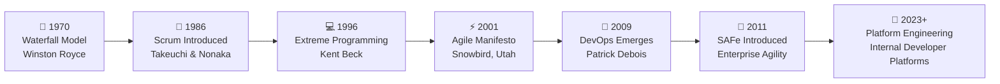

# 🧠 What is Agile?

Agile is not a methodology, a framework, or a set of rules. **Agile is a mindset.** It is a philosophy for software development that prioritizes flexibility, collaboration, and customer satisfaction through continuous delivery of valuable software.

## 📉 The Software Crisis of the 90s

Before Agile became the industry standard, software development was dominated by rigid, sequential models (often referred to as "Waterfall"). In the 1990s, the software industry faced what many called an "application delivery lag" or the **software crisis**. 

> [!WARNING]
> By the time a software project was planned, designed, coded, and tested—often taking up to 3 years—the business requirements had changed so drastically that the delivered software was obsolete upon arrival.

Teams were bogged down in extensive documentation and rigid contracts, stifling innovation and delaying time-to-market. The need for a lightweight, adaptable approach became undeniably urgent.

## 🌅 The Birth of Agile

In response to the heavy, documentation-driven processes, a group of 17 software developers met in Snowbird, Utah, in early 2001. They represented various emerging lightweight frameworks like Extreme Programming (XP), Scrum, and Feature-Driven Development (FDD). 

They sought common ground and ended up drafting the **Agile Manifesto**, officially coining the term "Agile" in the context of software development.

## 🗺️ Mindset vs. Methodology

A common misconception is treating Agile as a strict methodology. 

> [!NOTE]
> **Agile is a Mindset** described by 4 values and defined by 12 principles. 
> 
> **Scrum, Kanban, and XP** are frameworks and methodologies that *implement* the Agile mindset.

Agile is about continuously adapting to change rather than strictly following a predefined plan. It empowers teams to make decisions, encourages direct communication, and focuses on delivering working software in small, incremental batches.

## 🔄 Agile vs. Traditional Thinking

| Aspect | Traditional Thinking (Waterfall) | Agile Thinking |
| :--- | :--- | :--- |
| **Scope** | Fixed early in the project | Flexible and evolves over time |
| **Delivery** | Single, massive release at the end | Continuous, small, incremental releases |
| **Planning** | Upfront and detailed | Adaptive and continuous |
| **Team Structure** | Siloed and specialized | Cross-functional and collaborative |
| **Risk** | High (discovered late in testing) | Low (mitigated through continuous feedback) |

## 🚀 Why Agile Matters Today (The DevOps Connection)

Today, businesses operate in a volatile, uncertain, complex, and ambiguous (VUCA) environment. Agile is no longer just a competitive advantage; it is a necessity for survival. 

Agile laid the cultural groundwork for **DevOps**. Without the Agile principles of small batch sizes, continuous feedback, and cross-functional collaboration, the technical practices of Continuous Integration and Continuous Deployment (CI/CD) wouldn't be effective. Agile optimizes the *what* and *why*, while DevOps optimizes the *how*.

## ⏱️ Timeline of Software Development Methodologies

