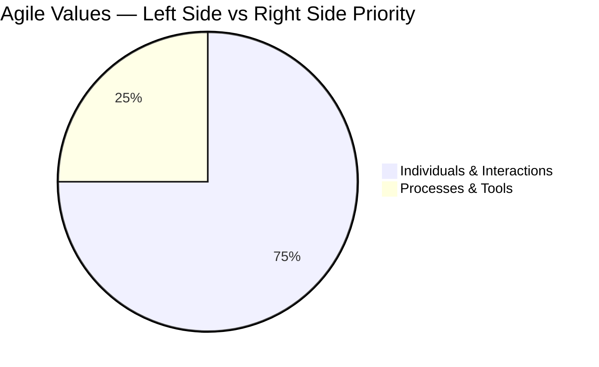
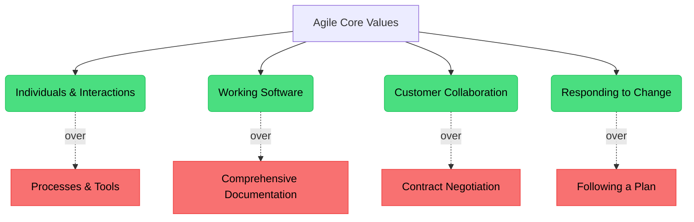

# 📜 The Agile Manifesto

The Manifesto for Agile Software Development is the foundational document that defines the Agile mindset. It establishes a set of values that prioritize adaptability, collaboration, and customer focus.

## 🏔️ The Snowbird Meeting (2001)

In February 2001, 17 software practitioners met at the Snowbird ski resort in Utah. They were advocates of various "lightweight" methods like Scrum, Extreme Programming (XP), Crystal, and Feature-Driven Development. 

Despite their different approaches, they shared a common frustration with the heavy, documentation-driven software development processes of the time. They agreed on a core set of values and principles, resulting in the **Agile Manifesto**.

## ⚖️ The Meaning of "Over"

The manifesto states its values in a specific format: "X over Y". 

> [!IMPORTANT]
> A critical line at the end of the manifesto is often overlooked:
> *"That is, while there is value in the items on the right, we value the items on the left more."*

Agile does not mean eliminating documentation, planning, or contracts. It means that when push comes to shove, the items on the left hold higher priority for project success.

## 💎 The 4 Core Values

### 1. Individuals and interactions over processes and tools
Tools and processes are necessary, but they are useless without competent people communicating effectively. A brilliant tool cannot compensate for a dysfunctional team. Face-to-face conversation and strong team dynamics solve problems faster than strict adherence to a process.

### 2. Working software over comprehensive documentation
Historically, teams spent months writing exhaustive requirements before writing a single line of code. By the time the software was built, the requirements had changed. Agile values delivering working, functional software as the primary measure of progress. Documentation should be "barely sufficient" and created just-in-time.

### 3. Customer collaboration over contract negotiation
Traditional projects often involved rigid contracts defining scope upfront, leading to adversarial relationships when changes were needed. Agile promotes a partnership with the customer. Continuous feedback loops ensure the team is building what the customer actually needs, rather than what was guessed months ago.

### 4. Responding to change over following a plan
Change is inevitable in software development—markets shift, technologies evolve, and user needs change. Traditional project management viewed change as an expense to be minimized. Agile embraces change as a competitive advantage. Plans are necessary, but they must be flexible enough to adapt to new information.

## 📊 Visualizing the Values

