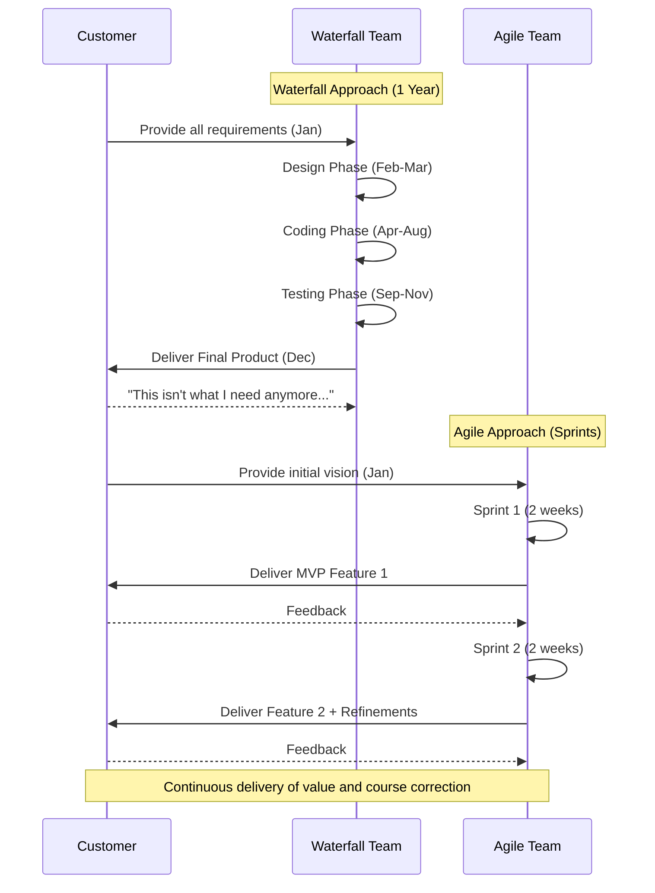

# 🌊 Agile vs. Waterfall

Understanding the contrast between Agile and traditional Waterfall development is essential for appreciating why modern DevOps practices exist. 

## 🆚 Detailed Comparison

| Feature | Waterfall | Agile |
| :--- | :--- | :--- |
| **Approach** | Linear, sequential phases | Iterative, incremental cycles |
| **Scope** | Fixed upfront | Flexible and evolving |
| **Cost & Time** | Variable (often overrun) | Fixed per iteration (Timeboxed) |
| **Customer Involvement** | High at start and end, low in middle | Continuous throughout the process |
| **Testing Phase** | Occurs late in the cycle | Continuous and automated |
| **Risk of Failure** | High (discovered late) | Low (mitigated early) |
| **Documentation** | Comprehensive, exhaustive | Barely sufficient, focused on working software |

## 📉 When Waterfall is Appropriate

Despite its criticisms, Waterfall is not universally bad. It shines in specific contexts:
- **Strict Regulatory Requirements**: Aerospace, medical devices, or defense contracts where exhaustive documentation and predictable, signed-off phases are legally required.
- **Fixed, Unchanging Scope**: Building a physical bridge or a factory where requirements absolutely will not change once construction begins.
- **Well-Understood Domain**: Replicating an existing system with zero unknowns.

## 🚀 When Agile Shines

Agile is the superior choice for modern software development:
- **High Uncertainty**: Startups or new product development where user needs are still being discovered.
- **Fast-Pacing Markets**: E-commerce or SaaS where competitors move quickly and time-to-market is critical.
- **Complex Systems**: Software where it is impossible to perfectly predict all edge cases upfront.

## 🧬 Hybrid Approaches (Water-Scrum-Fall)

Many large enterprises operate in a hybrid model, often dubbed **"Water-Scrum-Fall"**. 
- **Water**: Upfront budgeting, annual planning, and portfolio management.
- **Scrum**: Development teams iterate in sprints.
- **Fall**: Rigid, manual release governance, CAB (Change Advisory Board) approvals, and infrequent deployments.

> [!CAUTION]
> Hybrid approaches often experience friction. A team might develop rapidly (Agile) but hit a massive bottleneck during deployment (Waterfall operations). **This specific friction is what DevOps was created to solve.**

## 📊 Timeline Comparison

