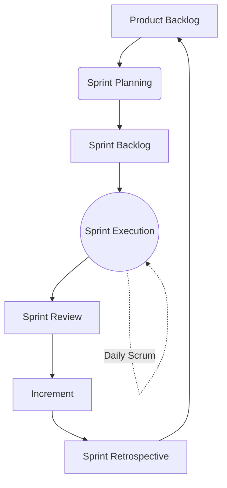

# 🏉 Scrum Overview

> [!NOTE]
> Scrum is a lightweight framework that helps people, teams, and organizations generate value through adaptive solutions for complex problems.

Scrum is not a process, technique, or definitive method. Rather, it is a framework within which you can employ various processes and techniques. It is simple to understand but difficult to master.

---

## 🏛️ Scrum Theory

Scrum is founded on **Empiricism** (knowledge comes from experience and making decisions based on what is observed) and **Lean Thinking** (reduces waste and focuses on the essentials).

Empiricism asserts that knowledge comes from experience and making decisions based on what is observed. Scrum employs an iterative, incremental approach to optimize predictability and control risk.

### The Three Pillars of Empiricism

1. **🔍 Transparency**
   The emergent process and work must be visible to those performing the work as well as those receiving the work. Without transparency, inspection is misleading and wasteful.
2. **👀 Inspection**
   The Scrum artifacts and the progress toward agreed goals must be inspected frequently and diligently to detect potentially undesirable variances or problems.
3. **🔄 Adaptation**
   If any aspects of a process deviate outside acceptable limits or if the resulting product is unacceptable, the process being applied or the materials being produced must be adjusted. The adjustment must be made as soon as possible to minimize further deviation.

---

## 🔄 The Scrum Framework Diagram

---

## 💎 Scrum Values

Successful use of Scrum depends on people becoming more proficient in living five values:

| Value | Description |
| :--- | :--- |
| **Commitment** | People personally commit to achieving the goals of the Scrum Team. |
| **Courage** | Scrum Team members have the courage to do the right thing and work on tough problems. |
| **Focus** | Everyone focuses on the work of the Sprint and the goals of the Scrum Team. |
| **Openness** | The Scrum Team and its stakeholders agree to be open about all the work and the challenges with performing the work. |
| **Respect** | Scrum Team members respect each other to be capable, independent people. |

> [!IMPORTANT]  
> When these values are embodied by the Scrum Team and the people they work with, the empirical Scrum pillars of transparency, inspection, and adaptation come to life building trust for everyone.

---

## 📜 History of Scrum

- **1986:** Hirotaka Takeuchi and Ikujiro Nonaka introduce the term *Scrum* in the context of product development in their Harvard Business Review article, "The New New Product Development Game".
- **Early 1990s:** Ken Schwaber and Jeff Sutherland independently start using Scrum approaches at their respective companies.
- **1995:** Schwaber and Sutherland jointly present a paper describing the Scrum framework at OOPSLA.
- **2001:** Schwaber and Sutherland are among the co-authors of the *Agile Manifesto*.
- **2010:** The first *Scrum Guide* is published. It is periodically updated to reflect the evolution of Scrum.
