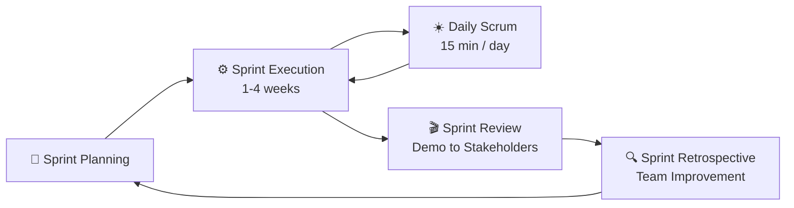

# 📅 Scrum Ceremonies (Events)

> [!NOTE]
> The Sprint is a container for all other events. Each event in Scrum is a formal opportunity to inspect and adapt Scrum artifacts. These events are specifically designed to enable the transparency required.

Failure to operate any events as prescribed results in lost opportunities to inspect and adapt. Events are used in Scrum to create regularity and to minimize the need for meetings not defined in Scrum.

---

## 🔄 The Sprint Cycle

---

## 1. 🏃 The Sprint

Sprints are the heartbeat of Scrum, where ideas are turned into value. They are fixed length events of one month or less to create consistency. A new Sprint starts immediately after the conclusion of the previous Sprint.

- **Timebox:** 1 to 4 weeks (usually 2 weeks).
- **Purpose:** Provide a container for all other work and events. Enable predictability by ensuring inspection and adaptation of progress toward a Product Goal at least every calendar month.

> [!IMPORTANT]
> During the Sprint:
> - No changes are made that would endanger the Sprint Goal.
> - Quality does not decrease.
> - The Product Backlog is refined as needed.
> - Scope may be clarified and renegotiated with the Product Owner as more is learned.

---

## 2. 🎯 Sprint Planning

Sprint Planning initiates the Sprint by laying out the work to be performed for the Sprint. This resulting plan is created by the collaborative work of the entire Scrum Team.

- **Timebox:** Maximum 8 hours for a one-month Sprint (usually shorter for shorter Sprints).
- **Purpose:** To define the Sprint Goal, select items from the Product Backlog, and create an actionable plan (Sprint Backlog) to deliver them.
- **The "What":** The Product Owner discusses the objective and the highest priority Product Backlog items. The team selects items they can complete.
- **The "How":** The Developers plan the work necessary to create an Increment that meets the Definition of Done.

> [!WARNING]
> **Anti-pattern:** The PO dictating how much work the team must take, or the team committing to work they don't understand.

---

## 3. ☀️ Daily Scrum

The purpose of the Daily Scrum is to inspect progress toward the Sprint Goal and adapt the Sprint Backlog as necessary, adjusting the upcoming planned work.

- **Timebox:** 15 minutes.
- **Purpose:** To improve communications, identify impediments, promote quick decision-making, and consequently eliminate the need for other meetings.
- **Format:** The Developers can select whatever structure and techniques they want, as long as their Daily Scrum focuses on progress toward the Sprint Goal. (Historically, the "3 Questions" were popular: What did I do yesterday? What will I do today? What impediments are in my way?)

> [!WARNING]
> **Anti-pattern:** Treating the Daily Scrum as a status report to the Scrum Master or PO instead of a synchronization meeting for the Developers. Problem-solving during the Daily Scrum (discussions should be taken offline).

---

## 4. 🎬 Sprint Review

The purpose of the Sprint Review is to inspect the outcome of the Sprint and determine future adaptations. The Scrum Team presents the results of their work to key stakeholders and progress toward the Product Goal is discussed.

- **Timebox:** Maximum 4 hours for a one-month Sprint.
- **Purpose:** To demonstrate the working increment, gather feedback, and collaboratively update the Product Backlog based on new insights.
- **Activities:** The PO explains what has been "Done". The Developers demonstrate the work. Stakeholders provide feedback.

> [!WARNING]
> **Anti-pattern:** A PowerPoint presentation instead of a working software demo. Stakeholders not attending.

---

## 5. 🔍 Sprint Retrospective

The purpose of the Sprint Retrospective is to plan ways to increase quality and effectiveness. The Scrum Team inspects how the last Sprint went with regards to individuals, interactions, processes, tools, and their Definition of Done.

- **Timebox:** Maximum 3 hours for a one-month Sprint.
- **Purpose:** Continuous improvement. To identify what went well, what could be improved, and commit to actionable changes for the next Sprint.

### Common Formats
1. **Start, Stop, Continue:**
   - **Start:** Things the team should begin doing.
   - **Stop:** Things that are holding the team back.
   - **Continue:** Good practices that should be maintained.
2. **The 4 Ls (Liked, Learned, Lacked, Longed For):** Explores feelings and factual learning.
3. **Mad, Sad, Glad:** Focuses on the emotional pulse of the team.

> [!TIP]
> The most critical outcome of a Retrospective is at least one actionable, concrete improvement item that is added to the Sprint Backlog for the next Sprint.
