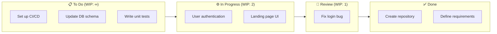

# 📋 Kanban Overview

Kanban is a popular lean workflow management method designed to help visualize work, maximize efficiency, and improve continuously. 

> [!NOTE]
> **Origin:** Kanban originated in the late 1940s at **Toyota** as an inventory control system for supply chains. Taiichi Ohno developed it to align inventory levels with actual consumption. Decades later, it was adapted for knowledge work and software development by David J. Anderson.

---

## 🎯 Core Principles

Kanban for knowledge work is built on four foundational principles:
1. **Start with what you do now:** Respect existing roles, responsibilities, and processes.
2. **Agree to pursue incremental, evolutionary change:** Avoid sweeping, disruptive changes that cause resistance.
3. **Respect current roles, responsibilities, and titles:** Overcome fear of change by securing buy-in.
4. **Encourage acts of leadership at all levels:** Anyone can suggest improvements, from individual contributors to management.

---

## ⚙️ The 6 Core Practices

To successfully implement Kanban, teams must adopt these six core practices:

1. **Visualize the Workflow:** Create a visual model of your process (usually a Kanban board).
2. **Limit Work In Progress (WIP):** Set limits on how many items can be in a given stage at one time to prevent bottlenecks and context switching.
3. **Manage Flow:** Monitor the movement of items through the workflow. Optimize for smooth and predictable delivery.
4. **Make Policies Explicit:** Clearly define the rules of the workflow (e.g., "Definition of Done" for each column).
5. **Implement Feedback Loops:** Hold regular meetings (stand-ups, service delivery reviews) to align and improve.
6. **Improve Collaboratively, Evolve Experimentally:** Use the scientific method and metrics to guide continuous improvement.

---

## 🗺️ Kanban Board Anatomy

A standard Kanban board visualizes the flow of work from requested to completed.

> [!IMPORTANT]  
> A column's **WIP Limit** is the true engine of Kanban. If the "In Progress" column has a WIP limit of 3, the team cannot start a 4th item until one of the current 3 is moved to "Review". This creates a **pull system**.

---

## 📊 Key Metrics

Unlike Scrum, which focuses on Velocity and Story Points, Kanban emphasizes flow metrics.

### ⏱️ Cycle Time vs. Lead Time

| Metric | Definition | Start Point | End Point |
|---|---|---|---|
| **Lead Time** | Total time from a customer request to delivery. | When request is added to backlog | When delivered to customer |
| **Cycle Time** | Time actively spent working on the item. | When work begins (enters "In Progress") | When work is completed |

> [!TIP]
> **Formula:** `Lead Time = Wait Time + Cycle Time`. To improve Lead Time, often the easiest win is reducing wait time in queues rather than working faster.

### 📈 Throughput vs. Velocity

* **Throughput:** The number of items delivered in a given time period (e.g., 5 features per week). It counts items regardless of their size.
* **Velocity (Scrum):** The amount of estimated work (e.g., 30 story points) delivered in a Sprint. 

**Why Kanban prefers Throughput:** Kanban assumes items are broken down into roughly equal sizes, making simple counts (Throughput) a statistically reliable forecasting tool when combined with Little's Law.
