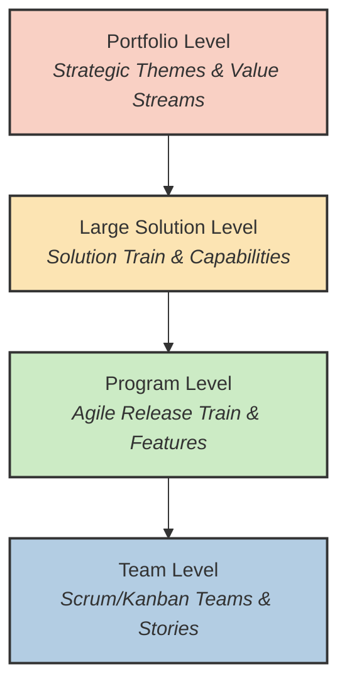

# 🚂 Scaled Agile Framework (SAFe) Overview

The **Scaled Agile Framework (SAFe)** is a set of organization and workflow patterns intended to guide enterprises in scaling lean and agile practices. 

> [!NOTE]  
> Created by Dean Leffingwell in 2011, SAFe is currently the most popular framework for scaling Agile in large enterprises, though it is also heavily debated within the Agile community.

---

## 🏢 Why is Scaling Needed?

Frameworks like Scrum and Kanban work exceptionally well for single teams (5-11 people). However, when a massive enterprise needs hundreds or thousands of people to build complex cyber-physical systems (like self-driving cars, banking infrastructure, or aerospace software), cross-team dependencies and strategic alignment become massive bottlenecks.

Scaling frameworks attempt to solve:
* Cross-team dependency management
* Aligning daily team work with corporate strategy
* Consistent portfolio funding and budgeting
* Coordinated release schedules across dozens of teams

---

## 🍰 The Levels of SAFe

SAFe can be configured in different ways (Essential, Large Solution, Portfolio, Full). In its full configuration, it operates on four levels:

1. **Portfolio Level:** Focuses on enterprise strategy, funding value streams, and managing large-scale Epics.
2. **Large Solution Level:** (Optional) Used for massive, complex systems that require multiple Agile Release Trains to build.
3. **Program Level:** Teams of teams align to build Features. This is the heart of SAFe, centered around the Agile Release Train.
4. **Team Level:** Individual Agile teams (using Scrum or Kanban) executing work and delivering software increments.

---

## 🚂 The Agile Release Train (ART)

The **Agile Release Train (ART)** is the primary value delivery construct in SAFe. 
* It is a long-lived team of Agile teams (typically 50-125 people).
* An ART includes all roles needed to deliver value (devs, testers, ops, business, security).
* It operates on a synchronized cadence, typically delivering a **Program Increment (PI)** every 8–12 weeks.

---

## 🗓️ PI Planning (Program Increment Planning)

PI Planning is the defining event of SAFe.

> [!IMPORTANT]
> PI Planning is a cadence-based, face-to-face (or highly structured virtual) event that serves as the heartbeat of the ART, aligning all teams on the ART to a shared mission and Vision.

* **Duration:** Typically 2 full days.
* **Attendees:** Everyone on the ART (all teams, stakeholders, leadership).
* **Outcome:** 
  1. Committed PI Objectives.
  2. An ART Planning Board showing cross-team dependencies and feature delivery dates.

---

## ⚖️ SAFe: Pros and Criticisms

SAFe is widely adopted but highly controversial among Agile purists.

### ✅ Pros of SAFe
* **Alignment:** Excellent for aligning hundreds of developers to a single corporate strategy.
* **Visibility:** Dependencies are mapped out heavily in advance, reducing surprises.
* **Enterprise Friendly:** Fits well into traditional corporate budgeting, governance, and middle-management structures.

### ❌ Criticisms of SAFe
* **Too Heavy:** Highly prescriptive with massive overhead, roles, and certifications.
* **"Agile in Name Only":** Critics argue SAFe is just Waterfall disguised with Agile terminology (often called "Water-Scrum-Fall").
* **Top-Down:** Violates the Agile Manifesto's preference for "individuals and interactions over processes and tools."
* **Slow Adaptation:** The 10-week PI cycle can prevent teams from pivoting rapidly to market changes.
