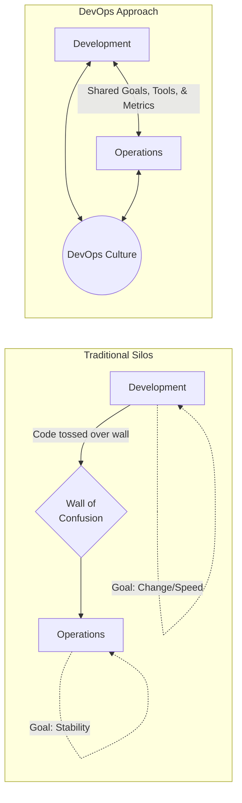

# 🚀 What is DevOps?

> [!NOTE]
> DevOps is a combination of cultural philosophies, practices, and tools that increases an organization's ability to deliver applications and services at high velocity. It is a fundamental shift in how organizations build, deliver, and operate software.

## 🧱 The Wall of Confusion

Before the DevOps movement, software development (Dev) and IT operations (Ops) existed in strict, isolated silos. This separation created what is famously known as the **"Wall of Confusion."**

* **Developers** were incentivized to create and push new features as quickly as possible.
* **Operations** were incentivized to maintain stability, reliability, and uptime, which often meant resisting change.

When developers finished their code, they would metaphorically "toss it over the wall" to operations for deployment. This led to a predictable cycle of friction: deployments failed, operations blamed development for writing buggy code, and development blamed operations for having incorrectly configured environments. 

### 📉 The Old Silos vs. 🚀 DevOps Collaboration

## 📜 A Brief History of DevOps

The term DevOps emerged from a growing frustration with this siloed approach.

* **2008:** Andrew Shafer and Patrick Debois discussed "Agile Infrastructure" at the Agile Toronto conference.
* **2009:** At the O'Reilly Velocity Conference, John Allspaw and Paul Hammond gave a seminal presentation titled *"10+ Deploys Per Day: Dev and Ops Cooperation at Flickr"*. This proved that Dev and Ops could collaborate for massive success.
* **Late 2009:** Inspired by Velocity, Patrick Debois organized the first **DevOpsDays** event in Ghent, Belgium, officially coining the term "DevOps".

## 🧠 What DevOps Actually Means (It's Not Just Tools!)

> [!IMPORTANT]
> The most common mistake organizations make is assuming they can "buy DevOps" by purchasing automation tools.

DevOps is a **cultural movement** first. Tools simply facilitate the culture. 
At its core, DevOps means:
1. **Shared Responsibility:** "You build it, you run it." Developers take ownership of how their code behaves in production. Operations personnel get involved earlier in the development process.
2. **Empathy:** Understanding the challenges faced by other teams.
3. **Continuous Improvement:** A relentless focus on removing bottlenecks in the software delivery process.

## 🤼 DevOps vs. SRE vs. Platform Engineering

As DevOps matured, specific implementations and disciplines emerged to solve its challenges at scale.

| Discipline | Focus | Analogy |
| :--- | :--- | :--- |
| **DevOps** | A cultural philosophy emphasizing collaboration, automation, and shared goals between Dev and Ops. | The *philosophy* of how to build and run software. |
| **Site Reliability Engineering (SRE)** | A prescriptive way of doing DevOps pioneered by Google. It applies software engineering practices to operations problems. | An *implementation* of the DevOps philosophy. "Class SRE implements interface DevOps". |
| **Platform Engineering** | Building Internal Developer Platforms (IDPs) to provide paved roads and self-service capabilities for developers, reducing cognitive load. | Creating the *infrastructure* that makes DevOps practices easy and scalable. |

## 🚫 Common Misconceptions

> [!WARNING]
> Beware of these DevOps anti-patterns!

* ❌ **"DevOps is a specific tool or pipeline."** (False: It's a culture and practice).
* ❌ **"DevOps means NoOps."** (False: Operations is more important than ever, but the *nature* of the work shifts from manual toil to engineering automation).
* ❌ **"DevOps is a job title."** (False: While "DevOps Engineer" is a common title, DevOps is a way of working that applies to the whole organization).
* ❌ **"DevOps is only for startups."** (False: Massive enterprises successfully adopt DevOps practices).
