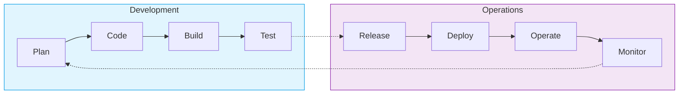

# ♾️ The DevOps Lifecycle

> [!NOTE]
> The DevOps lifecycle is often represented as an infinity loop. This signifies that software development and delivery is a continuous, iterative process rather than a linear, finite project.

## 🔄 The Infinity Loop

## 🛠️ The 8 Phases of the DevOps Lifecycle

### 1. 📝 Plan
The starting point where requirements are gathered, features are prioritized, and work is broken down into manageable chunks (sprints/iterations).
* **What Happens:** Agile ceremonies, backlog grooming, sprint planning, defining metrics for success.
* **Key Tools:** Jira, Trello, Asana, Azure Boards, GitHub Projects.
* **DevOps Practices:** Continuous Exploration, Value Stream Mapping.

### 2. 💻 Code
Developers write code to implement the planned features and bug fixes.
* **What Happens:** Writing code, peer reviews, pulling from version control, committing changes.
* **Key Tools:** Git, GitHub, GitLab, Bitbucket, VS Code, IntelliJ.
* **DevOps Practices:** Version Control, Trunk-Based Development, Pair Programming, Peer Code Reviews.

### 3. 🏗️ Build
Source code is compiled, dependencies are fetched, and deployable artifacts are created.
* **What Happens:** Code compilation, dependency resolution, static code analysis (linting).
* **Key Tools:** Maven, Gradle, npm, Docker, Jenkins, GitHub Actions.
* **DevOps Practices:** Continuous Integration (CI), Automated Builds, Dependency Management.

### 4. 🧪 Test
Automated testing is performed to ensure the code meets quality standards and doesn't break existing functionality.
* **What Happens:** Unit testing, integration testing, security scanning (SAST/DAST).
* **Key Tools:** JUnit, Selenium, Cypress, SonarQube, Jest.
* **DevOps Practices:** Continuous Testing, Shift-Left Security, Test-Driven Development (TDD).

### 5. 📦 Release
The build artifact is deemed ready for deployment and is versioned and stored in an artifact repository.
* **What Happens:** Tagging releases, storing artifacts, generating release notes.
* **Key Tools:** Artifactory, Nexus, AWS ECR, Docker Hub.
* **DevOps Practices:** Release Management, Artifact Versioning.

### 6. 🚀 Deploy
The artifact is deployed to various environments (staging, production) in an automated, consistent manner.
* **What Happens:** Infrastructure provisioning, application deployment, database migrations.
* **Key Tools:** Terraform, Ansible, ArgoCD, Kubernetes, AWS CodeDeploy.
* **DevOps Practices:** Continuous Deployment (CD), Infrastructure as Code (IaC), Blue/Green Deployments, Canary Releases.

### 7. ⚙️ Operate
Managing the application and infrastructure in the production environment.
* **What Happens:** Auto-scaling, backups, configuration management, maintaining uptime.
* **Key Tools:** Kubernetes, AWS/Azure/GCP Consoles, Chef, Puppet.
* **DevOps Practices:** Site Reliability Engineering (SRE), Runbooks, Chaos Engineering.

### 8. 📊 Monitor
Continuously observing the application and infrastructure to detect issues, gather user feedback, and measure performance.
* **What Happens:** Log aggregation, metrics collection, tracing, alerting on anomalies.
* **Key Tools:** Prometheus, Grafana, Datadog, Splunk, ELK Stack, PagerDuty.
* **DevOps Practices:** Continuous Monitoring, Observability, Blameless Postmortems, Telemetry.

> [!TIP]
> The Monitor phase feeds directly back into the Plan phase. The metrics and user feedback gathered in production are exactly what inform the planning for the *next* iteration of the loop!
