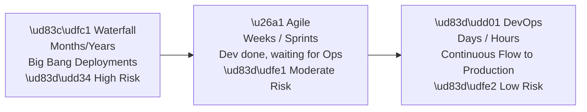
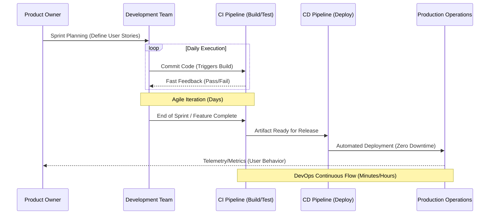

# 🌉 From Agile to DevOps: The Natural Evolution

> [!IMPORTANT]
> Agile and DevOps are not competing methodologies. DevOps is the logical and necessary continuation of Agile principles. You cannot truly master DevOps without Agile, and Agile without DevOps stops short of delivering true customer value.

## 🧬 Why DevOps is the Natural Evolution of Agile

Agile fundamentally changed how software is *built*. It broke down massive, multi-year projects into 2-week sprints. It fostered collaboration between the business (Product Owners) and developers.

However, Agile had a blind spot: **It stopped at "Code Complete."**

In the early days of Agile, a Dev team might finish a sprint, build an incredible feature, and then... wait six weeks for the Operations team's next "release window." The agility gained in development was entirely lost in the deployment bottleneck.

**DevOps emerged to solve this problem.** It extends Agile principles past the developer's laptop, through the testing environments, and all the way into production operations.

### The Fundamental Difference

| Aspect | Agile | DevOps |
| :--- | :--- | :--- |
| **Focus** | How to *build* the right software, iteratively. | How to *deliver and operate* software, continuously. |
| **Primary Challenge Addressed** | Changing requirements and building what the customer actually wants. | Deployment bottlenecks, infrastructure instability, and the Dev vs. Ops silo. |
| **Key Output** | Working software at the end of a Sprint. | Software running reliably in production. |
| **Target Audience** | Business stakeholders and Developers. | Developers, QA, Security, and IT Operations. |

## 🔗 Mapping Agile Principles to DevOps Practices

The DNA of DevOps is inherited directly from the Agile Manifesto. Here is how core Agile principles map to specific DevOps engineering practices:

| Agile Principle (The "What") | DevOps Practice (The "How") | How it Works |
| :--- | :--- | :--- |
| *Our highest priority is to satisfy the customer through early and continuous delivery of valuable software.* | **CI/CD Pipelines** | Automating the build, test, and deployment process ensures software is continuously ready for release. |
| *Deliver working software frequently, from a couple of weeks to a couple of months, with a preference to the shorter timescale.* | **Continuous Deployment & Microservices** | Breaking monolithic architectures into microservices allows for deployment multiple times a day, not just every sprint. |
| *Working software is the primary measure of progress.* | **Observability & Telemetry** | "Working" means running successfully in production. APM (Application Performance Monitoring) proves the software works. |
| *Continuous attention to technical excellence and good design enhances agility.* | **Infrastructure as Code (IaC) & Automated Testing** | Defining infrastructure in code and running automated test suites ensures technical excellence is enforced systematically. |
| *Build projects around motivated individuals. Give them the environment and support they need.* | **Internal Developer Platforms (IDPs) & Blameless Culture** | Providing self-service tools and psychological safety so developers can operate autonomously. |

## ⏱️ Connecting Sprint Cadence to the Pipeline

A beautifully planned Agile Sprint is useless if the CI/CD pipeline is broken. Here is how they interact:

## 🤝 The Cultural Overlap

The transition from Agile to DevOps is seamless culturally. Both demand:
1. **Cross-functional teams:** Agile brought QA and Dev together; DevOps brings Ops and Security into that same team.
2. **Servant Leadership:** Management exists to remove blockers (like manual approval boards), not to dictate technical solutions.
3. **Continuous Retrospectives:** Agile uses retrospectives to improve the team process; DevOps uses blameless post-mortems to improve systemic reliability.
