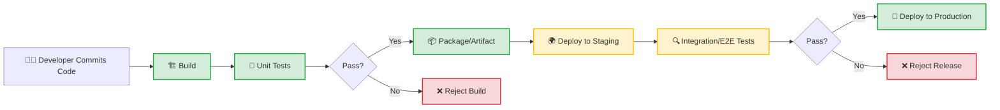

# 🔄 CI/CD Overview

> [!NOTE]  
> **Continuous Integration and Continuous Delivery/Deployment (CI/CD)** is a method to frequently deliver apps to customers by introducing automation into the stages of app development.

## 📖 Introduction to CI/CD

CI/CD is the backbone of modern DevOps. It bridges the gap between development and operations teams by automating the building, testing, and deployment of applications. 

### From "Integration Hell" to Modern CI/CD
Historically, teams worked in silos for long periods before attempting to merge their code—a phase notoriously known as **Integration Hell**. The result was a massive number of merge conflicts, broken builds, and unpredictable release cycles. CI/CD was born out of the need to solve this by integrating smaller batches of code more frequently and automating the validation process.

## 🧩 The CI/CD/CD Distinction

It's crucial to understand the nuances between the three "C"s in CI/CD.

| Term | What It Is | Goal | Human Intervention? |
|------|------------|------|---------------------|
| **Continuous Integration (CI)** | Merging code changes frequently into a central repository. | Automatically build and test changes to detect issues early. | None (Automated). |
| **Continuous Delivery (CD)** | Ensuring the codebase is *always* in a deployable state. | Automatically prepare the artifact for release to an environment. | Yes (Manual trigger for production deployment). |
| **Continuous Deployment (CD)** | Automatically releasing every change that passes tests to production. | Eliminate manual steps, delivering value to users immediately. | None (Fully automated). |

> [!IMPORTANT]  
> **Continuous Delivery** means you *can* deploy at any time. **Continuous Deployment** means you *do* deploy every time. 

## 🗺️ The CI/CD Pipeline

The pipeline is the central nervous system of DevOps automation. It defines the series of steps code must pass through to reach production.

## ✨ Key Benefits of CI/CD

- **Faster Time to Market:** Automating the pipeline reduces manual overhead, enabling rapid feature delivery.
- **Improved Code Quality:** Automated testing catches bugs before they reach production.
- **Reduced Risk:** Smaller, frequent updates are easier to troubleshoot and rollback than massive, infrequent releases.
- **Enhanced Developer Productivity:** Developers spend less time managing environments and deployments, and more time writing code.
- **Faster Feedback Loops:** Immediate notifications on build or test failures allow for rapid course correction.

> [!TIP]  
> Start small. Implement CI first to get comfortable with automated builds and testing before moving on to automated deployments.
