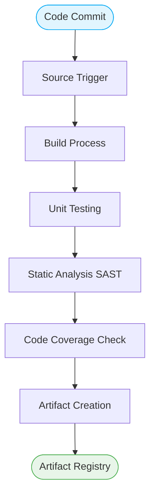

# 🏗️ Continuous Integration (CI) Pipeline

> [!NOTE]  
> **Continuous Integration (CI)** is the practice of automating the integration of code changes from multiple contributors into a single software project. It’s a primary DevOps best practice, allowing developers to frequently merge code changes into a central repository where builds and tests then run.

## 🎯 Why Frequent Integration Matters

The longer a developer holds onto un-merged code, the higher the risk of conflicts and integration bugs. Frequent integration (at least daily) ensures that the codebase remains stable and functional.

## 🛤️ CI Pipeline Stages

A robust CI pipeline validates the code automatically. 

1. **Source Trigger:** The pipeline starts automatically upon a commit or pull request creation (e.g., via Webhooks).
2. **Build Process:** The source code is compiled into executable code or interpreted scripts are packaged. Dependencies are downloaded and resolved.
3. **Unit Testing:** The smallest units of code are tested in isolation. Fast execution is critical here.
4. **Static Analysis (SAST):** Static Application Security Testing scans the source code for vulnerabilities and enforces coding standards (Linting).
5. **Code Coverage:** Ensures a minimum percentage of the codebase is covered by tests.
6. **Artifact Creation:** The successful build is packaged into a deployable artifact (e.g., Docker image, JAR file) and pushed to a registry.

## 🌿 Branching Strategies

### Trunk-Based Development vs Feature Branches

| Strategy | Description | Pros | Cons |
|----------|-------------|------|------|
| **Feature Branches** | Developers work on long-lived branches per feature before merging. | Clear isolation of work. | Higher risk of merge conflicts; delays integration. |
| **Trunk-Based Development** | Developers merge small, frequent updates to a central "trunk" (main) branch multiple times a day. | Promotes true CI; minimizes merge pain. | Requires strong automated testing and feature flags. |

> [!IMPORTANT]  
> True Continuous Integration requires Trunk-Based Development. If you merge a feature branch once a week, you are doing Continuous Isolation, not Continuous Integration.

## ✅ CI Best Practices

| Best Practice | Description |
|---------------|-------------|
| **Maintain a Single Source Repository** | All source code, tests, and deployment scripts must live in version control. |
| **Automate the Build** | Building the application should be a single-command operation. |
| **Keep the Build Fast** | The CI pipeline should complete in under 10 minutes to provide quick feedback. |
| **Test in a Clone of Production** | The CI environment should mirror the production environment as closely as possible. |
| **Make the Build Self-Testing** | Tests must run automatically without human intervention and return clear Pass/Fail results. |
| **Fix Broken Builds Immediately** | A broken build halts the team. Fixing it should be the highest priority. |

## 🚫 Common CI Anti-Patterns

- **Ignoring Test Failures:** Allowing pipelines to pass when non-critical tests fail.
- **Slow Feedback:** Pipelines that take hours to run cause context-switching and lost productivity.
- **Manual Interventions in CI:** Requiring a human to push a button or approve a step during the integration phase.

> [!WARNING]  
> Beware of "Flaky Tests" (tests that pass or fail randomly without code changes). They erode trust in the CI pipeline. Quarantine or fix them immediately.
