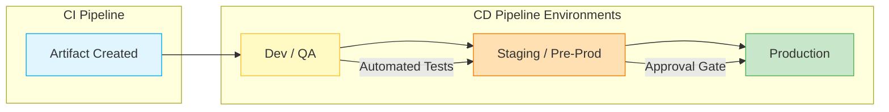

# 🚀 Continuous Delivery & Continuous Deployment (CD)

> [!NOTE]  
> The "CD" in CI/CD can stand for **Continuous Delivery** or **Continuous Deployment**. Both are extensions of Continuous Integration, but they dictate how code ultimately reaches the end user.

## ⚖️ Continuous Delivery vs Continuous Deployment

| Feature | Continuous Delivery | Continuous Deployment |
|---------|---------------------|-----------------------|
| **Definition** | Code is always ready to be deployed, but the actual deployment is manual. | Every change that passes automated tests is automatically deployed. |
| **Human Intervention** | Requires manual approval (a click of a button). | Fully automated; no human gate. |
| **Primary Goal** | Business decides *when* to release. | Speed to market; immediate feedback. |
| **Risk Tolerance** | Lower risk; suited for critical systems. | Higher risk; requires exceptional automated testing and rollbacks. |

> [!IMPORTANT]  
> Continuous Deployment is not suitable for all applications (e.g., software for medical devices or aerospace). Continuous Delivery is generally the gold standard for most enterprise applications.

## 🚉 Deployment Pipeline Stages

Once the CI pipeline creates an artifact, the CD pipeline takes over to safely usher it to production.

1. **Development/QA Environment:** Automated Integration Testing, API testing, and initial manual QA.
2. **Staging Environment:** A clone of production. Used for Performance Testing, Load Testing, and User Acceptance Testing (UAT).
3. **Approval Gates:** (In Continuous Delivery) Security, compliance, or business sign-offs before moving to production.
4. **Production Environment:** The live system serving real users.

## 🌍 Environment Promotion Strategy

Artifacts should be promoted through environments immutably. **Do not rebuild the artifact for each environment.** 

> [!TIP]  
> Build Once, Deploy Anywhere. Inject environment-specific configurations (like database connections) at runtime using environment variables, not at build time.

## ⏪ Rollback and Deployment Strategies

Safely deploying code means having a plan for when things go wrong.

### 1. Blue-Green Deployment
Two identical environments exist (Blue and Green). Traffic is routed to Blue. New version is deployed to Green. Once verified, traffic is switched to Green.
- **Pros:** Instant rollback, zero downtime.
- **Cons:** Expensive (requires double the infrastructure).

### 2. Canary Release
Route a small percentage of traffic (e.g., 5%) to the new version. Monitor for errors. Gradually increase traffic until 100% is on the new version.
- **Pros:** Minimizes blast radius of bugs, validates with real users.
- **Cons:** Complex to manage routing and metrics.

### 3. Rolling Update
Gradually replace instances of the old version with the new version, one (or a few) at a time.
- **Pros:** No downtime, cost-effective.
- **Cons:** Rollback takes time; multiple versions run concurrently.

> [!CAUTION]  
> Always ensure database schema changes are backward-compatible when using zero-downtime deployment strategies.
