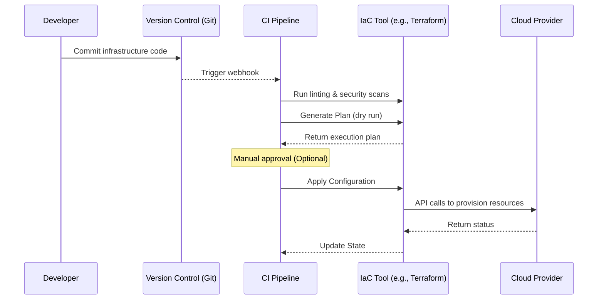

# 🏗️ Infrastructure as Code (IaC)

Infrastructure as Code (IaC) is the practice of managing and provisioning computing infrastructure and resources through machine-readable definition files, rather than through physical hardware configuration or interactive configuration tools.

> [!NOTE]
> IaC applies software engineering practices (version control, testing, continuous integration) to infrastructure management.

## ⚖️ IaC vs Manual Provisioning

| Feature | Manual Provisioning | Infrastructure as Code |
| :--- | :--- | :--- |
| **Speed** | Slow and tedious | Fast and automated |
| **Consistency** | High risk of configuration drift | Identical environments |
| **Documentation** | Often outdated or missing | Code serves as living documentation |
| **Scaling** | Hard to scale across environments | Easy to replicate |
| **Cost** | High human resource cost | Lower operational cost |

## 🔄 Declarative vs Imperative IaC

- **Declarative (What):** You define the desired state of the system, and the IaC tool determines how to achieve that state. (e.g., Terraform, CloudFormation)
- **Imperative (How):** You define the specific commands or steps the system needs to execute to achieve the desired state. (e.g., Ansible, Chef scripts)

> [!TIP]
> The industry standard heavily favors the **declarative** approach because it handles state reconciliation and dependency management for you.

## 🛠️ Key Tools Comparison

| Tool | Approach | State Management | Best Use Case |
| :--- | :--- | :--- | :--- |
| **Terraform** | Declarative (HCL) | Managed State File | Multi-cloud resource provisioning |
| **Pulumi** | Declarative (Real Code) | Managed State File | Developer-centric infrastructure |
| **Ansible** | Imperative/Declarative (YAML)| Stateless | Configuration management & CI/CD |
| **AWS CloudFormation**| Declarative (JSON/YAML) | AWS Managed | AWS-native infrastructure |

## 🌟 Best Practices

- **Version Control Everything:** Treat infrastructure code exactly like application code.
- **Use Modules:** Break down monolithic configurations into reusable, composable modules.
- **Manage State Carefully:** Store state files securely (e.g., in a remote backend like S3 with state locking via DynamoDB) and never commit state files containing secrets to version control.
- **DRY (Don't Repeat Yourself):** Utilize variables and modules to avoid duplicating code across environments (dev, staging, prod).

> [!WARNING]
> Never manually edit a resource that is managed by IaC. This causes "configuration drift" and can lead to resources being destroyed on the next IaC run.

## 🧪 Testing Strategies for IaC

1. **Static Analysis (Linting):** Validating syntax and code style (e.g., `tflint`).
2. **Security & Compliance Scanning:** Checking for misconfigurations and vulnerabilities before deployment (e.g., `tfsec`, `checkov`).
3. **Plan Validation:** Reviewing the execution plan before applying (e.g., `terraform plan`).
4. **Integration Testing:** Actually deploying infrastructure to an ephemeral environment, running tests, and tearing it down (e.g., Terratest).

## 💻 Example: Terraform HCL Snippet

```hcl
# Configure the AWS Provider
provider "aws" {
  region = "us-east-1"
}

# Create a VPC
resource "aws_vpc" "main" {
  cidr_block = "10.0.0.0/16"

  tags = {
    Name        = "main-vpc"
    Environment = "production"
  }
}

# Create an EC2 Instance
resource "aws_instance" "web" {
  ami           = "ami-0c55b159cbfafe1f0"
  instance_type = "t2.micro"
  subnet_id     = aws_vpc.main.id

  tags = {
    Name = "HelloWorld"
  }
}
```

## 📈 IaC Workflow


