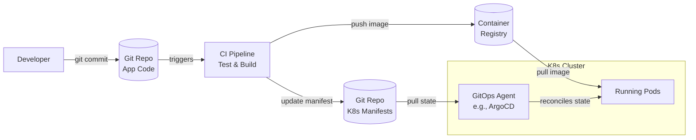

# 🐙 GitOps

GitOps is an operational framework that takes DevOps best practices used for application development such as version control, collaboration, compliance, and CI/CD, and applies them to infrastructure automation.

> [!IMPORTANT]
> In GitOps, **Git is the single source of truth** for both infrastructure and applications.

## 🎯 The 4 GitOps Principles

According to the OpenGitOps working group, a GitOps managed system follows these principles:

1. **Declarative:** A system managed by GitOps must have its desired state expressed declaratively.
2. **Versioned and Immutable:** Desired state is stored in a way that enforces immutability, versioning, and retains a complete version history.
3. **Pulled Automatically:** Software agents automatically pull the desired state declarations from the source.
4. **Continuously Reconciled:** Software agents continuously observe actual system state and attempt to apply the desired state.

## 🔄 Push-based vs Pull-based Deployments

GitOps introduces a shift from traditional Push-based CI/CD to a Pull-based model.

### Traditional CD (Push Model)
The CI/CD pipeline runs tests, builds an artifact, and then *pushes* the deployment directly to the target environment (e.g., runs `kubectl apply` or `helm upgrade`). 
* **Drawback:** The pipeline needs credentials to access the production cluster.

### GitOps (Pull Model)
An agent running *inside* the target environment (e.g., ArgoCD, Flux) monitors a Git repository. When the repository changes, the agent *pulls* the new configuration and applies it.
* **Benefit:** The cluster pulls configuration; no external system needs inbound access to the cluster.

> [!TIP]
> The pull-based model significantly enhances security by limiting cluster access and avoiding exposing production credentials to external CI tools.

## 🛠️ Key Tools

- **ArgoCD:** A declarative, GitOps continuous delivery tool for Kubernetes, known for its excellent UI and visual representation of application state.
- **Flux:** A set of continuous and progressive delivery solutions for Kubernetes that are open and extensible.

## 📊 Comparison: Push-based CD vs GitOps

| Feature | Traditional Push CD | GitOps (Pull CD) |
| :--- | :--- | :--- |
| **Source of Truth** | Often scattered between Git, Pipeline config, and manual changes | Git strictly |
| **Security** | CI tool requires admin credentials to the cluster | Cluster operator only needs read access to Git |
| **Drift Detection** | Difficult to detect manual changes in cluster | Continuous reconciliation corrects drift automatically |
| **Rollback** | Requires running pipeline with previous version | Simple `git revert` or pointing to previous commit |
| **Disaster Recovery** | Complex, depends on external state | Fast; apply Git state to a new cluster |

## 📈 GitOps Workflow with Kubernetes

## ⚖️ Benefits and Limitations

**Benefits:**
- Enhanced security (no cluster credentials in CI)
- Complete audit trail (Git history)
- Easy rollbacks (`git revert`)
- Automatic drift detection and correction

**Limitations:**
- Steeper learning curve for teams new to declarative concepts
- Primarily designed for Kubernetes (though expanding)
- Complex secret management (requires tools like Sealed Secrets, SOPS, or External Secrets Operator)
