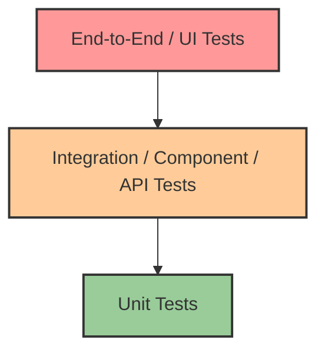

# ⏪ Shift-Left Testing

Shift-Left Testing is the practice of moving testing, quality, and performance evaluation to the left—or earlier—in the software development lifecycle (SDLC). 

Instead of waiting for code to be fully developed and deployed to a staging environment before QA tests it, developers run tests locally and in early CI pipeline stages.

## 📉 The Cost of Late Bug Detection

The cost of fixing a bug grows exponentially the later it is found in the SDLC.

> [!WARNING]
> A bug found in production can cost 100x more to fix than the same bug found during the coding/design phase. It involves rollback, customer impact, hotfixes, and context switching.

## 🧪 Types of Tests in CI/CD

| Test Type | Scope | Execution Speed | Cost/Complexity |
| :--- | :--- | :--- | :--- |
| **Unit Tests** | Individual functions or classes | Extremely Fast | Low |
| **Component/Integration Tests** | Multiple units working together | Fast | Medium |
| **Contract Tests** | API boundaries between microservices | Fast | Medium |
| **End-to-End (E2E) Tests** | Entire system workflow (UI to DB) | Slow | High |
| **Performance Tests** | System behavior under load | Medium/Slow | High |
| **Security Scans (SAST/DAST)** | Code vulnerabilities and runtime flaws| Fast to Medium | Medium |

## 🔺 The Test Pyramid

The Test Pyramid is a metaphor representing how testing should be distributed. You should have a large foundation of fast, cheap unit tests and a small number of slow, expensive E2E tests.

> [!TIP]
> **Anti-pattern: The Ice Cream Cone.** If you rely heavily on manual UI testing and E2E tests while neglecting unit tests, your feedback loops will be slow and flaky.

## 📊 Test Coverage Metrics

- **Line Coverage:** Percentage of code lines executed by tests.
- **Branch Coverage:** Percentage of decision branches (if/else) executed.
- **Mutation Testing:** Testing the tests themselves by introducing small changes (mutations) to the code to see if tests fail.

*Note: 100% coverage is often a vanity metric. Aim for meaningful tests over pure coverage numbers.*

## 🔒 Shift-Left Security (DevSecOps)

Security must also shift left. This includes:

- **SAST (Static Application Security Testing):** Analyzing source code for vulnerabilities (e.g., SonarQube, Checkmarx) directly in the IDE or early CI.
- **SCA (Software Composition Analysis):** Scanning dependencies for known CVEs (e.g., Snyk, Dependabot).
- **DAST (Dynamic Application Security Testing):** Testing the running application for flaws.
- **Container Scanning:** Scanning Docker images for vulnerabilities before pushing to the registry.

## ⚙️ Practical Implementation in a Pipeline

A shifted-left pipeline workflow:

1. **Local Dev:** Developer writes code, IDE runs linting and basic SAST.
2. **Pre-commit:** Git hooks run unit tests and formatters.
3. **CI - Build Stage:** Fast unit tests, SCA scanning, compilation.
4. **CI - Integration Stage:** Integration tests against mocked services.
5. **CD - Deployment:** E2E smoke tests in a staging environment.
