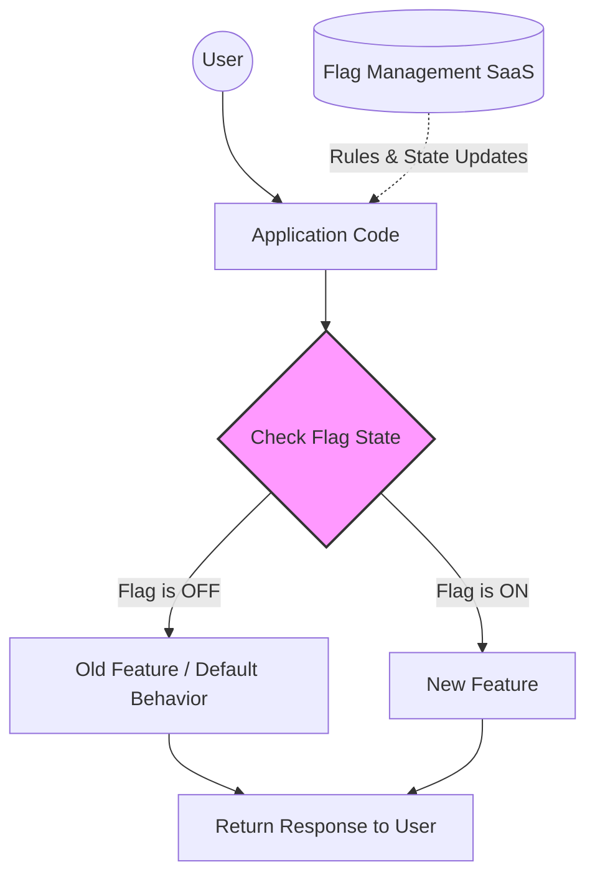

# 🚩 Feature Flags (Toggles)

Feature flags are a software development technique that allows teams to turn specific functionality on or off without deploying new code. 

> [!IMPORTANT]
> The primary superpower of feature flags is **decoupling deployment from release**. You can deploy code to production at any time, but only release the feature to users when ready.

## 🗂️ Types of Flags

1. **Release Flags (Short-lived):** Used to hide unfinished or unvalidated features. Once the feature is fully rolled out and stable, the flag should be removed.
2. **Experiment Flags (Short-lived):** Used for A/B testing to measure the impact of a change on user behavior or metrics.
3. **Ops Flags (Long-lived):** Used to control operational aspects, like temporarily disabling a heavy background job during peak traffic, or enabling maintenance mode.
4. **Permission/Entitlement Flags (Long-lived):** Used to manage premium features for specific users or tiers (e.g., "Pro Plan" users).

## 🚀 Use Cases

### Canary Releases
Slowly roll out a new feature to a small percentage of users (e.g., 5%) to ensure it doesn't cause errors or degrade performance before expanding to 100%.

### A/B Testing
Serve Feature A to 50% of users and Feature B to the other 50%. Compare business metrics (conversion rate, time on site) to determine the winner.

### Kill Switches
Instantly disable a broken feature in production without requiring a rollback deployment.

## 🛠️ Tools

- **LaunchDarkly:** Enterprise-grade, highly scalable SaaS platform.
- **Split:** Focuses heavily on data-driven experimentation and A/B testing.
- **Flagsmith:** Open-source option with SaaS or self-hosted models.
- **Unleash:** Open-source, privacy-first feature management.

## 📈 Feature Flag Flow

## ⚠️ Risks and Technical Debt

> [!WARNING]
> If short-lived flags are not removed after a feature is launched, the codebase becomes cluttered with dead code, increasing complexity and maintenance overhead.

**Best Practices:**
- **Flag Lifecycle Management:** Create a process (e.g., Jira tickets) for removing flags once they are 100% rolled out.
- **Naming Conventions:** Name flags clearly based on what they do and their intended lifecycle.
- **Default Fallbacks:** Always define a safe fallback in case the flag service is unreachable.
- **Keep it Simple:** Avoid nesting multiple feature flags within each other, which creates an explosion of testable states.
