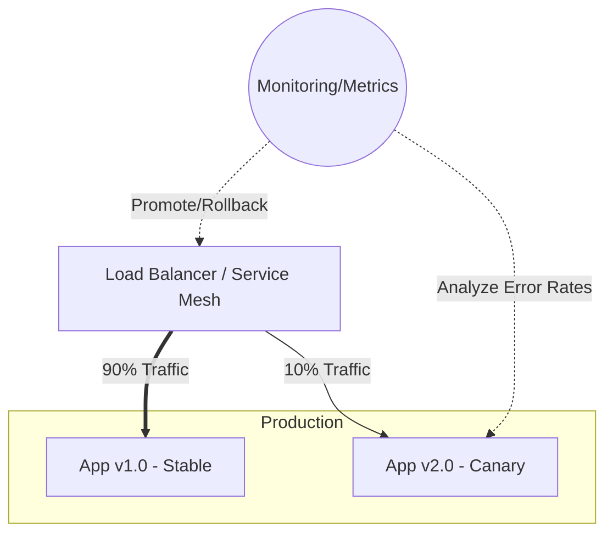

# 🔄 Advanced Deployment Strategies

Moving beyond simple in-place updates, modern deployment strategies aim to minimize risk, reduce downtime, and allow for safe validation of new code in production.

## 💥 Recreate (Big Bang)
The old version is completely shut down before the new version is started.
* **Pros:** Simple, avoids running two versions simultaneously (good for breaking schema changes).
* **Cons:** Guarantees downtime during the deployment window.

## 🎡 Rolling Update
Instances of the previous version are slowly replaced by instances of the new version, one by one (or in small batches).
* **Pros:** Zero downtime, native to platforms like Kubernetes.
* **Cons:** Takes time to roll out fully; difficult to roll back quickly; old and new versions run concurrently.

---

## 🔵🟢 Blue/Green Deployment

You maintain two identical production environments: "Blue" (currently live) and "Green" (idle). You deploy the new version to the Green environment, test it thoroughly, and then simply flip a router/load balancer to point all traffic to Green.

* **Pros:** Zero downtime, instant rollback (just flip the router back to Blue).
* **Cons:** Requires double the infrastructure resources. Data synchronization (especially databases) between Blue and Green can be complex.

### Blue/Green Workflow
```mermaid
graph TD
    LB[Load Balancer / Ingress]
    
    subgraph Environment Blue
        B_App[App v1.0]
    end
    
    subgraph Environment Green
        G_App[App v2.0]
    end
    
    LB ==>|100% Traffic| B_App
    LB -.->|0% Traffic| G_App
    
    Note right of G_App: Deploy & Test here first.<br/>When ready, switch LB.
```

---

## 🐤 Canary Deployment

You release the new version to a small subset of users (e.g., 5%). You monitor metrics (error rates, latency). If everything looks healthy, you gradually increase traffic to the new version (10%, 25%, 50%, 100%).

* **Pros:** Lowest risk for production impact; validates performance under real user traffic.
* **Cons:** Complex to set up (requires advanced traffic routing like Istio/Linkerd and automated metric analysis).

### Canary Workflow


---

## 🅰️/🅱️ Testing vs Canary

While similar mechanically, their goals differ:
* **Canary** is a *technical* risk mitigation strategy. "Does this new code break anything?"
* **A/B Testing** is a *business* strategy. "Does this new button color increase user signups?" A/B tests often run longer and require statistical significance.

## 🌘 Shadow / Dark Launch

Traffic sent to the live version is duplicated (shadowed) and sent to the new version simultaneously. The responses from the new version are ignored by the user but logged for analysis.
* **Pros:** Tests new code with real production load without impacting users.
* **Cons:** Hard to implement for stateful requests (e.g., you don't want to charge a user's credit card twice).

---

## 📊 Deployment Strategies Comparison

| Strategy | Risk | Downtime | Rollback Speed | Resource Cost | Complexity | Best For |
| :--- | :--- | :--- | :--- | :--- | :--- | :--- |
| **Recreate** | High | Yes | Slow | Low | Low | Non-critical internal apps, DB schema updates |
| **Rolling** | Medium | No | Slow | Low | Low | Standard stateless app updates |
| **Blue/Green**| Low | No | Instant | High (2x) | Medium | Mission-critical apps, strict uptime needs |
| **Canary** | Very Low | No | Fast | Low | High | Large scale user-facing applications |
| **Shadow** | Lowest | No | N/A | High | Very High | Major architectural rewrites |

> [!TIP]
> In Kubernetes, a Blue/Green deployment is often achieved by simply changing the `selector` on a Service to point from the old ReplicaSet to the new ReplicaSet.
