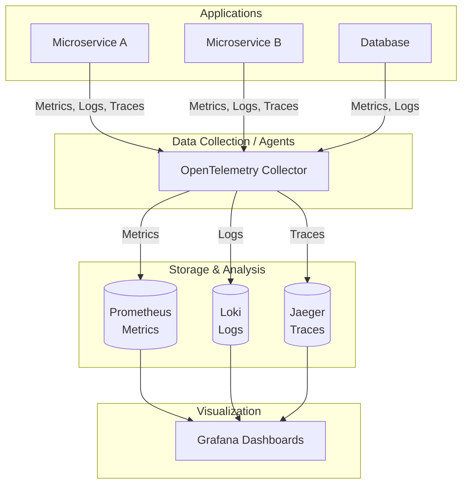

# 🔭 Observability and Monitoring

Understanding the state of our systems is critical in a DevOps environment. This section covers the shift from traditional monitoring to full observability.

## 📊 Observability vs. Monitoring

> [!NOTE]
> **Monitoring** tells you *when* a system is broken.
> **Observability** tells you *why* it's broken.

*   **Monitoring:** The process of collecting, analyzing, and using information to track a program's progress toward reaching its objectives. It answers the question, "Is the system working?"
*   **Observability:** A measure of how well internal states of a system can be inferred from knowledge of its external outputs. It answers the question, "Why is it not working, and how can I fix it?"

## 🏛️ The Three Pillars of Observability

Traditionally, observability is built on three fundamental data types:

1.  **Logs:** Immutable, time-stamped records of discrete events that happened over time.
2.  **Metrics:** Numeric representations of data measured over time intervals.
3.  **Traces:** Representations of a series of causally related distributed events that encode the end-to-end request flow through a distributed system.

### The MELT Framework

More recently, the **MELT** framework has expanded on the three pillars:
*   **M**etrics: Are we healthy?
*   **E**vents: What happened? (A specific, actionable type of log)
*   **L**ogs: Why did it happen?
*   **T**races: Where did it happen?

---

## 📝 Deep Dive: Logs, Metrics, and Traces

### 1. Structured Logging Best Practices

> [!TIP]
> Always use structured logging (e.g., JSON) instead of unstructured text. This makes logs easily searchable and parsable by machines.

*   **Include context:** Add Trace IDs, User IDs, and Session IDs to every log line.
*   **Use consistent keys:** Standardize field names (e.g., `user_id` instead of mixing `userId`, `Uid`, and `user_id`).
*   **Avoid sensitive data:** Never log PII, passwords, or tokens.

### 2. Types of Metrics

*   **Counter:** A cumulative metric that represents a single monotonically increasing counter whose value can only increase or be reset to zero on restart (e.g., total HTTP requests).
*   **Gauge:** A metric that represents a single numerical value that can arbitrarily go up and down (e.g., current memory usage, concurrent connections).
*   **Histogram:** Samples observations (usually things like request durations or response sizes) and counts them in configurable buckets. It also provides a sum of all observed values (e.g., API latency).

### 3. Distributed Tracing

In microservice architectures, a single user action might touch dozens of services.
*   **Span:** Represents a single unit of work (e.g., a database query or an HTTP request). Spans have start and end times.
*   **Trace:** A collection of spans that share the same **Trace ID**, representing the entire journey of a request.

---

## 🏗️ The Observability Stack Diagram

---

## 🛠️ Key Tools Comparison

| Tool Category | Open Source Leaders | Commercial Leaders | Description |
| :--- | :--- | :--- | :--- |
| **Metrics** | Prometheus, InfluxDB | Datadog, New Relic | Time-series databases for storing and querying metrics. |
| **Logs** | ELK Stack, Loki | Splunk, Datadog | Centralized logging solutions for searching and analyzing events. |
| **Traces** | Jaeger, Zipkin | Honeycomb, Datadog | Distributed tracing systems for debugging complex architectures. |
| **Visualization** | Grafana, Kibana | Datadog (built-in) | Dashboards for viewing observability data. |
| **Telemetry Std.** | OpenTelemetry | - | A CNCF standard for generating and collecting MELT data. |

> [!IMPORTANT]
> **OpenTelemetry (OTel)** is rapidly becoming the industry standard. Instead of using vendor-specific agents (like a Datadog agent or New Relic agent), applications emit OTel data, which can then be routed to any backend tool.
