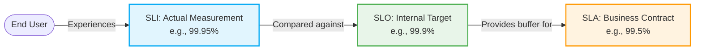

# 🎯 SLAs, SLIs, and SLOs

Defining reliability targets is a core practice of Site Reliability Engineering (SRE) and modern DevOps. This section breaks down the "SL-something" acronyms.

## 📖 Definitions

> [!IMPORTANT]
> - **SLA (Agreement):** What we promise the customer (and what we pay if we fail).
> - **SLO (Objective):** What we aim for internally (usually stricter than the SLA).
> - **SLI (Indicator):** What we actually measure right now.

### 1. SLI (Service Level Indicator)
A carefully defined quantitative measure of some aspect of the level of service that is provided.
*   **Formula:** `SLI = (Good Events / Valid Events) * 100`
*   **Example:** `(Successful HTTP GET requests / Total HTTP GET requests) * 100`

### 2. SLO (Service Level Objective)
A target value or range of values for a service level that is measured by an SLI. This is an internal goal set by the product and engineering teams.
*   **Example:** `99.9% of HTTP GET requests will be successful over a rolling 30-day window.`

### 3. SLA (Service Level Agreement)
An explicit or implicit contract with your users that includes consequences of meeting (or missing) the SLOs they contain.
*   **Example:** `If availability falls below 99.5% in a month, customers receive a 10% refund.`

---

## 🔗 The Relationship Diagram

---

## 📈 Common SLIs

| Category | Description | SLI Example |
| :--- | :--- | :--- |
| **Availability** | Is the service up? | The proportion of valid requests served successfully. |
| **Latency** | How fast is it? | The proportion of valid requests served in < 200ms. |
| **Error Rate** | Is it failing? | The proportion of valid requests that result in a 5xx error. |
| **Throughput** | How much data? | The amount of data processed per second (bytes/sec). |

---

## 💰 Error Budgets

An error budget is the tool that balances reliability with the pace of innovation.

> [!NOTE]
> If your SLO is 99.9% availability, your error budget is 0.1% unavailability. Over a 30-day month, that equates to **43 minutes and 12 seconds** of allowed downtime.

### How to Calculate
`Error Budget = 100% - SLO`

### How Error Budgets Enable Velocity
Google SRE uses error budgets to resolve the classic conflict between Dev (who want to ship features fast) and Ops (who want stability).

1.  **Budget is positive:** The team can release new features quickly and take risks.
2.  **Budget is depleted:** Feature releases are halted (except for security/bug fixes), and the team's entire focus shifts to reliability engineering until the budget replenishes.

### Alerting on SLOs (Burn Rates)

Alerting on simple thresholds (e.g., "CPU > 90%") is noisy. SREs alert on **Burn Rate**—how fast the error budget is being consumed.

*   **Burn Rate of 1:** You will consume exactly 100% of your budget over the 30-day window. (Normal)
*   **Burn Rate of 10:** You will consume your 30-day budget in 3 days. (Needs attention soon)
*   **Burn Rate of 1000:** You will consume your 30-day budget in 43 minutes. (Page someone IMMEDIATELY)
