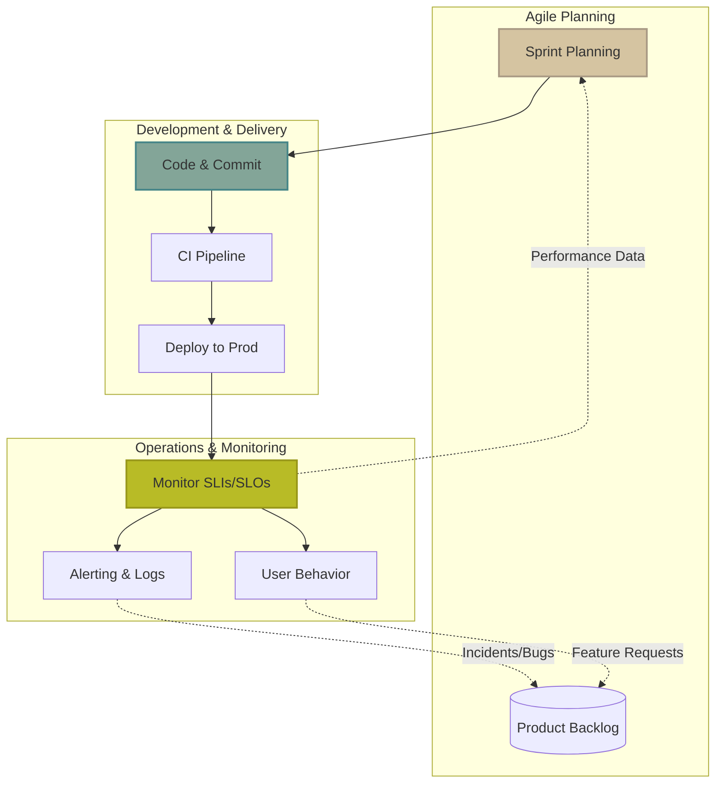

# 🔁 Feedback Loops

Feedback loops are the vital connective tissue between Operations and Development. Without them, Agile is just fast waterfall, and DevOps is just automation.

## 🌟 The Heart of Agile and DevOps

In *The Phoenix Project*, Gene Kim outlines "The Three Ways":
1.  **The First Way (Flow):** Understanding and increasing the flow of work from Left (Dev) to Right (Ops).
2.  **The Second Way (Feedback):** Creating short, fast feedback loops from Right to Left.
3.  **The Third Way (Continuous Learning):** Creating a culture that fosters experimentation, learning from failure, and understanding that repetition is the prerequisite to mastery.

> [!IMPORTANT]
> If you are deploying code to production rapidly (Flow) but have no idea how it performs or if users like it (Feedback), you have not achieved DevOps.

---

## 🔄 The Feedback Loop Cycle

---

## 🛠️ Connecting Monitoring to Planning

How does Ops data feed back into Agile planning?

1.  **Defect Tracking:** Monitoring alerts (e.g., elevated 500 errors) should automatically create tickets (Jira/ServiceNow) with attached tracing contexts.
2.  **Capacity Planning:** Metrics showing CPU/Memory growth over time inform architectural user stories in the backlog (e.g., "Refactor service X to scale horizontally").
3.  **Error Budget Depletion:** As discussed in SLIs/SLOs, burning through the budget dictates Sprint priorities (shifting from feature work to reliability work).

---

## ⏱️ Key Metrics: MTTD vs. MTTR

A crucial part of the feedback loop is how quickly a team can react to a problem.

*   **MTTD (Mean Time To Detect):** How long does it take you to realize something is broken? (Reduced by good monitoring/observability).
*   **MTTR (Mean Time To Recover):** Once you know it's broken, how long does it take to fix it? (Reduced by automated rollbacks, runbooks, and good CI/CD).

> [!TIP]
> In complex distributed systems, you cannot prevent all failures (MTBF - Mean Time Between Failures is a flawed metric). Instead, optimize for a rapid MTTD and MTTR.

---

## 🛡️ Blameless Postmortems

When a major incident occurs, the feedback loop demands a postmortem.

**Purpose:** To understand *what* happened, not *who* caused it, and to prevent it from happening again.

**Standard Format:**
1.  **Incident Summary:** Brief description of the impact.
2.  **Timeline:** Detailed chronological events (when it started, when we noticed, steps taken).
3.  **Root Cause Analysis (RCA):** The technical reason (e.g., using the "5 Whys" technique).
4.  **Resolution:** How the incident was mitigated.
5.  **Action Items:** Specific, prioritized backlog tickets to prevent recurrence (e.g., "Add timeout to database connection," "Create alert for high connection pool usage").

---

## 🌪️ Chaos Engineering as Proactive Feedback

Don't wait for production to break to get feedback. Chaos Engineering (popularized by Netflix's Chaos Monkey) involves intentionally injecting failure into a system to test its resilience.

*   **Hypothesis:** "If one database node goes down, the system will failover seamlessly."
*   **Experiment:** Terminate the primary DB node in a controlled manner.
*   **Feedback:** If the system crashes, you've found a weakness before it caused a 3 AM outage. Create a Jira ticket to fix it.
