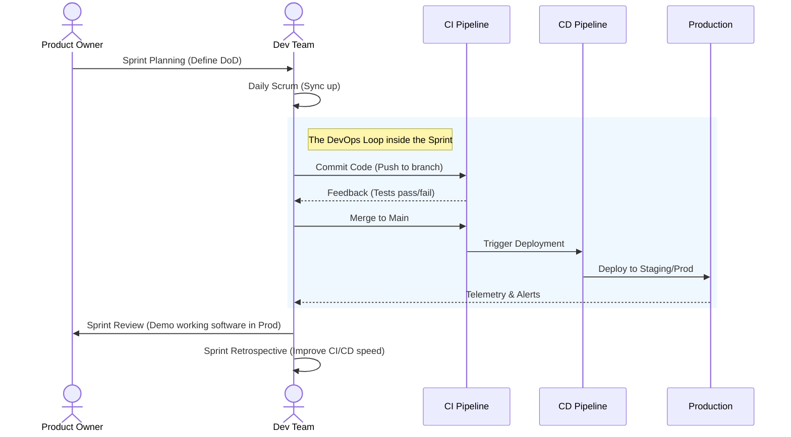

# 🏃‍♂️ From Sprint to Pipeline

How does a user story actually travel from a Jira board into the hands of a user? This section details the integration of Agile cadences with DevOps automation.

## 📖 The Story of a Feature (Day-by-Day)

Let's follow a user story: *"As a user, I want to reset my password so I can regain access to my account."*

*   **Day 1 (Sprint Planning):** The team pulls the story into the Sprint. Crucially, they define the **DevOps Definition of Done**.
*   **Day 2-3 (Development):** The developer writes the code *and* the automated tests. They also write the infrastructure code (Terraform) needed for the new email service queue.
*   **Day 4 (Commit & CI):** The developer opens a Pull Request. The CI pipeline runs unit tests, static code analysis (SonarQube), and security scans (SAST). The PR is reviewed and merged.
*   **Day 5 (CD & Staging):** The merge triggers the CD pipeline, deploying the feature to the Staging environment. Integration and E2E tests run automatically.
*   **Day 6 (Production & Monitoring):** The feature is deployed to Production behind a **Feature Flag**. The team turns it on for 5% of users. They watch the new SLI dashboards created for this feature.
*   **Day 7 (Feedback):** The feature is rolled out to 100%. The team reviews logs and metrics, confirming zero downtime and no error spikes. The story is marked "Done."

---

## 🔄 How CI/CD Supports Sprint Cadence

> [!NOTE]
> Agile demands working software at the end of every sprint. CI/CD makes this practically achievable without killing the team with manual deployment overhead.

*   **Continuous Integration (CI):** Ensures that code integrated multiple times a day doesn't break the build. This eliminates the massive "integration hell" at the end of a sprint.
*   **Continuous Delivery/Deployment (CD):** Ensures that the codebase is *always* in a deployable state. Sprints don't need dedicated "release days" because releasing is a non-event.

---

## 🎯 The DevOps Definition of Done (DoD)

In a traditional Agile setup, "Done" might just mean "coded and tested." In a DevOps environment, the DoD is expanded:

| Criteria | Traditional Agile | DevOps-Enhanced |
| :--- | :--- | :--- |
| **Code** | Written and reviewed | Written, reviewed, and merged to main |
| **Testing** | QA manually tested | Automated CI tests passed (unit, integration, security) |
| **Environment** | Works on Dev machine | Deployed successfully via CD pipeline |
| **Infrastructure** | Handed off to Ops | Infrastructure as Code (IaC) updated and applied |
| **Visibility** | N/A | Logs, metrics, and alerts are configured and active |

---

## 🗺️ Sprint Ceremonies Mapped to Pipelines

