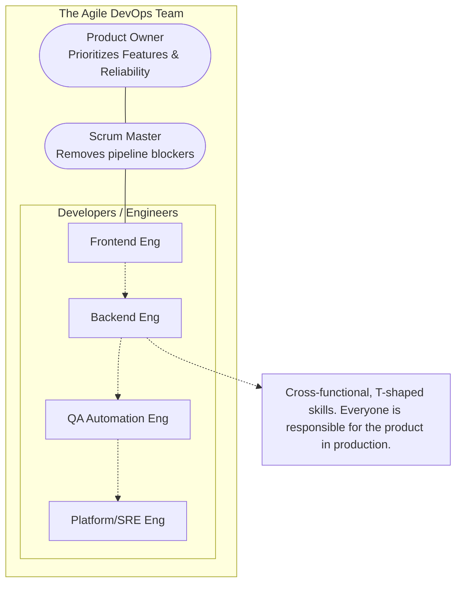

# 🤝 DevOps in the Scrum Team

Integrating operations into an Agile framework often poses a challenge: How do we handle unplanned operational work while trying to maintain a predictable Sprint velocity?

## 🧑‍🤝‍🧑 The DevOps Scrum Team Model

Historically, "DevOps" was mistakenly treated as a separate team you handed code to. Modern practice dictates embedding DevOps skill sets directly into the Scrum team.

> [!IMPORTANT]
> DevOps is not a title; it is a culture and a set of practices. A highly functional Scrum team has T-shaped members who can code features *and* deploy infrastructure.

### The Team Structure Diagram

---

## 📝 Infrastructure as User Stories

Operational tasks should not be hidden "shadow work." They must be visible on the Sprint board.

> [!TIP]
> Write infrastructure tasks as user stories to articulate their business value to the Product Owner.

### Examples of Ops User Stories:

1.  **CI/CD Improvement:**
    *   *Story:* "As a developer, I want the Docker build step to be cached so that my CI pipeline runs in under 3 minutes, increasing my daily iterations."
2.  **Observability:**
    *   *Story:* "As an on-call engineer, I want an alert for HTTP 500 errors exceeding 2% over 5 minutes, so I can detect outages before users complain."
3.  **Security/IaC:**
    *   *Story:* "As a security auditor, I want AWS IAM roles provisioned via Terraform so that permissions are version-controlled and auditable."

---

## ⚖️ Balancing Ops Work vs. Feature Work

Scrum is designed for planned work, but operations are inherently unpredictable (e.g., an outage). How do you manage this in a Sprint?

### Strategy 1: The Buffer
Allocate a percentage of the Sprint capacity (e.g., 20%) specifically for unplanned operational work and tech debt. If no incidents occur, the team pulls from the backlog.

### Strategy 2: The "Batman" / On-Call Rotation
Designate one team member per Sprint as the "Batman" (or "Shield", "Interrupt Handler").
*   Their sole job is to handle alerts, unblock CI pipelines, and deal with ad-hoc requests.
*   They are **exempt** from committing to feature points during that Sprint.
*   This protects the rest of the team's flow state and ensures predictable velocity for the remaining feature developers.

### Strategy 3: Error Budgets Drive Priorities
If the SLO is breached (Error Budget exhausted), the Product Owner must agree to halt new feature work and dedicate the entire Sprint backlog to reliability, stability, and tooling improvements.
