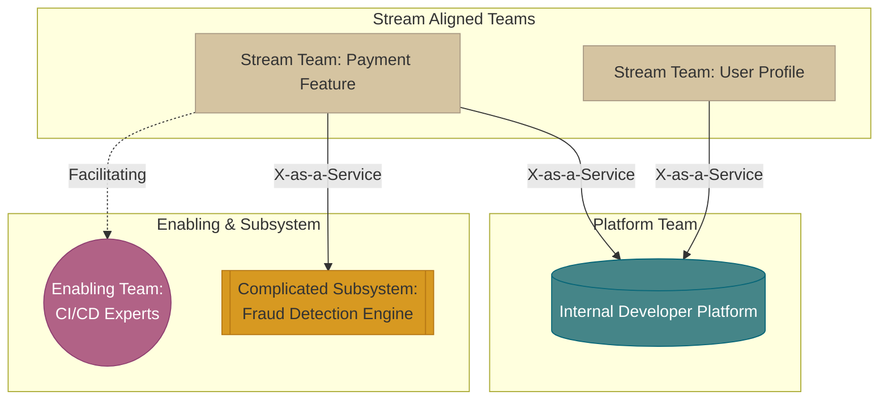

# 🏗️ Team Topologies

As organizations scale, flat Agile structures often break down. Matthew Skelton and Manuel Pais's book *Team Topologies* provides a framework for structuring teams for fast flow and optimal cognitive load.

## 🧠 Conway's Law

> [!WARNING]
> *"Any organization that designs a system (defined broadly) will produce a design whose structure is a copy of the organization's communication structure."* — Melvin Conway (1967)

If you have four siloed teams (DBA, Frontend, Backend, QA), you will inevitably build a monolithic application with four distinct tiers and heavy hand-off friction. Team Topologies uses the "Inverse Conway Maneuver": design your teams to match the software architecture you *want*.

---

## 🧱 The 4 Fundamental Team Types

1.  **Stream-aligned Team (The Core):**
    Aligned to a single, valuable stream of work (usually a product or feature). They build, deliver, and run their own application. They are the primary source of business value.
2.  **Platform Team:**
    Builds the underlying internal services and infrastructure (the Internal Developer Platform - IDP) that reduces the cognitive load of the Stream-aligned teams. They provide tools via self-service APIs.
3.  **Enabling Team:**
    Composed of specialists (e.g., Security, Test Automation) who assist Stream-aligned teams in overcoming obstacles and adopting new technologies. They do not write the core code; they mentor and train.
4.  **Complicated-Subsystem Team:**
    Manages a specific component that requires deep specialized knowledge (e.g., a real-time video rendering engine).

---

## 🔄 The 3 Interaction Modes

How these teams communicate is just as important as the teams themselves.

1.  **Collaboration:** Teams working closely together for a defined period to discover new patterns or solve a hard problem. (High communication overhead, use sparingly).
2.  **X-as-a-Service:** One team provides and one team consumes something via an API. (Low communication overhead, highly scalable).
3.  **Facilitating:** One team helps another learn a new skill or clear an impediment.

---

## 🗺️ Team Topologies Diagram

## 🛠️ The Internal Developer Platform (IDP)

> [!NOTE]
> The Platform team does *not* exist to deploy code for the Stream teams (that's an old Ops anti-pattern). 

The Platform team treats the Stream teams as their customers. They build a self-service product (the IDP) that handles the boilerplate of deployments, monitoring, and infrastructure provisioning, allowing developers to focus solely on business logic.
