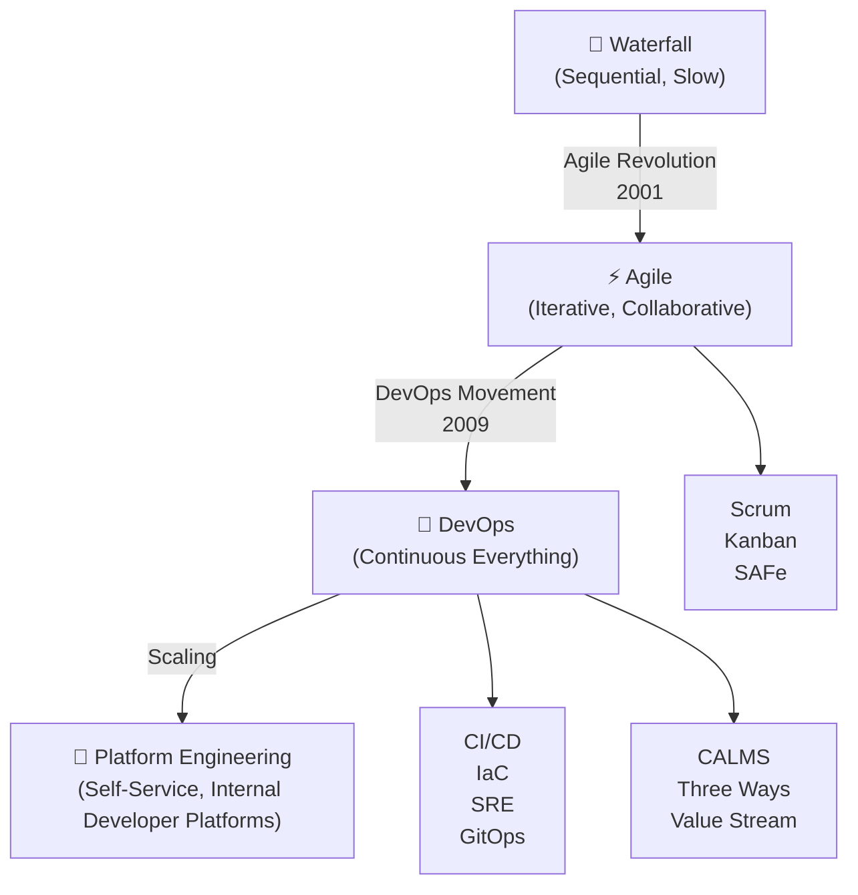
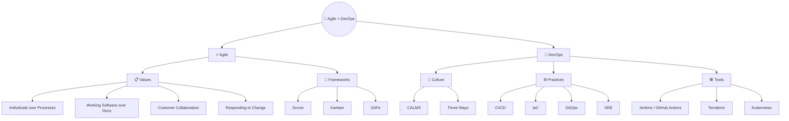

# 📘 Agile & DevOps Notes

> **"DevOps is Agile applied beyond the software team — to the entire organization."**
> — Gene Kim, *The Phoenix Project*

---

## 🎯 About This Repository

This repository is a structured, practical knowledge base covering **Agile methodologies** and **DevOps practices** — and most importantly, **how they connect**.

It's built for:
- 🧑‍💻 Engineers who want to deeply understand Agile + DevOps concepts
- 📋 Teams transitioning from traditional to Agile/DevOps workflows
- 📚 Anyone preparing for DevOps/Agile interviews or certifications

---

## 🗺️ The Big Picture

---

## 📚 Table of Contents

### Part 1 — Agile Foundations
| # | Topic | Description |
|---|-------|-------------|
| 1.1 | [What is Agile?](./01-Agile-Fundamentals/01-what-is-agile.md) | Agile mindset, history, and core ideas |
| 1.2 | [Agile Manifesto](./01-Agile-Fundamentals/02-agile-manifesto.md) | The 4 values and 12 principles explained |
| 1.3 | [Agile Principles Deep Dive](./01-Agile-Fundamentals/03-agile-principles.md) | Practical breakdown of all 12 principles |
| 1.4 | [Agile vs Waterfall](./01-Agile-Fundamentals/04-agile-vs-waterfall.md) | Comparison, when to use which |

### Part 2 — Agile Frameworks
| # | Topic | Description |
|---|-------|-------------|
| 2.1 | [Scrum Overview](./02-Agile-Frameworks/01-scrum/01-scrum-overview.md) | Full Scrum guide |
| 2.2 | [Scrum Roles](./02-Agile-Frameworks/01-scrum/02-scrum-roles.md) | PO, Scrum Master, Dev Team |
| 2.3 | [Scrum Ceremonies](./02-Agile-Frameworks/01-scrum/03-scrum-ceremonies.md) | Sprint Planning, Daily, Review, Retro |
| 2.4 | [Scrum Artifacts](./02-Agile-Frameworks/01-scrum/04-scrum-artifacts.md) | Backlog, Increment, Definition of Done |
| 2.5 | [Kanban Overview](./02-Agile-Frameworks/02-kanban/kanban-overview.md) | Flow-based, WIP limits, pull system |
| 2.6 | [Kanban vs Scrum](./02-Agile-Frameworks/02-kanban/kanban-vs-scrum.md) | When to use which |
| 2.7 | [SAFe Overview](./02-Agile-Frameworks/03-SAFe-overview.md) | Scaling Agile at enterprise level |

### Part 3 — DevOps Fundamentals
| # | Topic | Description |
|---|-------|-------------|
| 3.1 | [What is DevOps?](./03-DevOps-Fundamentals/01-what-is-devops.md) | Definition, history, and goals |
| 3.2 | [DevOps Culture — CALMS](./03-DevOps-Fundamentals/02-devops-culture.md) | Culture, Automation, Lean, Measurement, Sharing |
| 3.3 | [DevOps Lifecycle](./03-DevOps-Fundamentals/03-devops-lifecycle.md) | The ∞ loop: Plan → Code → Build → Test → Deploy → Monitor |
| 3.4 | [Agile → DevOps Bridge](./03-DevOps-Fundamentals/04-agile-to-devops.md) | **The critical connection** |

### Part 4 — CI/CD
| # | Topic | Description |
|---|-------|-------------|
| 4.1 | [CI/CD Overview](./04-CI-CD/01-ci-cd-overview.md) | What, Why, and How |
| 4.2 | [CI Pipeline](./04-CI-CD/02-ci-pipeline.md) | Continuous Integration deep dive |
| 4.3 | [CD Pipeline](./04-CI-CD/03-cd-pipeline.md) | Continuous Delivery vs Deployment |
| 4.4 | [Tools Comparison](./04-CI-CD/04-tools-comparison.md) | Jenkins vs GitHub Actions vs GitLab CI |
| 4.5 | [GitHub Actions Example](./04-CI-CD/examples/github-actions-example.yml) | Real working pipeline |
| 4.6 | [Jenkinsfile Example](./04-CI-CD/examples/jenkins-pipeline-example.groovy) | Declarative Jenkins pipeline |

### Part 5 — DevOps Practices
| # | Topic | Description |
|---|-------|-------------|
| 5.1 | [Infrastructure as Code](./05-DevOps-Practices/01-infrastructure-as-code.md) | IaC concepts, Terraform, Ansible |
| 5.2 | [GitOps](./05-DevOps-Practices/02-gitops.md) | Git as single source of truth |
| 5.3 | [Shift-Left Testing](./05-DevOps-Practices/03-shift-left-testing.md) | Test early, test often |
| 5.4 | [Feature Flags](./05-DevOps-Practices/04-feature-flags.md) | Decouple deploy from release |
| 5.5 | [Deployment Strategies](./05-DevOps-Practices/05-blue-green-canary.md) | Blue/Green, Canary, Rolling |

### Part 6 — Monitoring & Feedback
| # | Topic | Description |
|---|-------|-------------|
| 6.1 | [Observability](./06-Monitoring-and-Feedback/01-observability.md) | Logs, Metrics, Traces |
| 6.2 | [SLO / SLI / SLA](./06-Monitoring-and-Feedback/02-slo-sli-sla.md) | Reliability targets explained |
| 6.3 | [Feedback Loops](./06-Monitoring-and-Feedback/03-feedback-loops.md) | Connecting monitoring back to Agile |

### Part 7 — Agile + DevOps Integration
| # | Topic | Description |
|---|-------|-------------|
| 7.1 | [Sprint to Pipeline](./07-Agile-DevOps-Integration/01-sprint-to-pipeline.md) | How a Sprint becomes a release |
| 7.2 | [DevOps in Scrum](./07-Agile-DevOps-Integration/02-devops-in-scrum.md) | Merging practices |
| 7.3 | [Team Topologies](./07-Agile-DevOps-Integration/03-team-topologies.md) | Stream-aligned, Platform, Enabling teams |
| 7.4 | [Value Stream Mapping](./07-Agile-DevOps-Integration/04-value-stream-mapping.md) | Visualize and eliminate waste |

### Part 8 — Real-World Scenarios
| # | Topic | Description |
|---|-------|-------------|
| 8.1 | [Legacy to DevOps](./08-Real-World-Scenarios/scenario-01-legacy-to-devops.md) | Migration story |
| 8.2 | [Agile Adoption Journey](./08-Real-World-Scenarios/scenario-02-agile-adoption.md) | Common pitfalls and wins |

### 📋 Cheatsheets
| File | Description |
|------|-------------|
| [Scrum Cheatsheet](./assets/cheatsheets/scrum-cheatsheet.md) | Quick Scrum reference |
| [DevOps Toolchain](./assets/cheatsheets/devops-toolchain.md) | Tools by category |

---

## 🔑 Key Concepts at a Glance

---

## 📖 How to Use This Repository

1. **Start from the beginning** — Read Part 1 and 2 if you're new to Agile
2. **Jump to DevOps** — Part 3 bridges the gap between Agile and DevOps
3. **Get practical** — Parts 4 and 5 have real code examples
4. **See the integration** — Part 7 is where everything clicks together
5. **Use cheatsheets** — Quick references are in `/assets/cheatsheets/`

---

## 🤝 Contributing

Feel free to open issues or PRs if you spot errors or want to add content. See [CONTRIBUTING.md](./CONTRIBUTING.md).

---

*Built with ❤️ as a personal learning and reference resource.*
